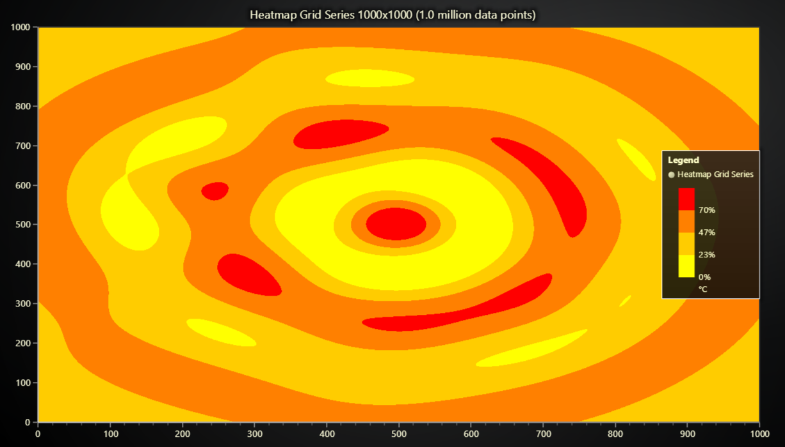

# JavaScript Heatmap Grid Chart



This demo application belongs to the set of examples for LightningChart JS, data visualization library for JavaScript.

LightningChart JS is entirely GPU accelerated and performance optimized charting library for presenting massive amounts of data. It offers an easy way of creating sophisticated and interactive charts and adding them to your website or web application.

The demo can be used as an example or a seed project. Local execution requires the following steps:

-   Make sure that relevant version of [Node.js](https://nodejs.org/en/download/) is installed
-   Open the project folder in a terminal:

          npm install              # fetches dependencies
          npm start                # builds an application and starts the development server

-   The application is available at _http://localhost:8080_ in your browser, webpack-dev-server provides hot reload functionality.


## Description

This example showcases simple usage of `HeatmapGridSeries`, a simple, yet incredibly series type.

`HeatmapGridSeries` visualizes three dimensional data (X, Y, color) of large quantities.
It can easily handle data sets in million data points range even on low-end devices.
With large amounts of RAM even **billions** of data points can be visualized!

Heatmaps can be created in XY Charts:

```javascript
// Add heatmap Grid Series to a XY Chart
chartXY.addHeatmapGridSeries({
    columns: horizontalResolution,
    rows: verticalResolution,
})
```

The data used for the heatmap is created using the WaterdropGenerator function in the example code.

# Heatmap Grid Series options

When `HeatmapGridSeries` is created, there are minimum of two properties that have to be specified:

`columns`: amount of data values along X dimension.

`rows`: amount of data values along Y dimension.

Configuration of these two properties is enough for a fully functioning heatmap grid series.

The following optional properties can be used for tweaking heatmap behavior for exact application purposes:

`start`: Axis coordinate where heatmap grid begins.

`end`: Axis coordinate where heatmap grid ends.

`step`: Alternate syntax, supplying a `step` value will result in automatic calculation of `end` based on `columns` / `rows` amount.

`dataOrder`: By default incoming intensity data is treated as _list of columns_. This can be flipped by selecting `dataOrder: 'rows'`.

# Heatmap Grid Series data input

The data set of `HeatmapGridSeries` is defined as a _number matrix_, for example:

```js
// Example syntax of 3x5 number matrix.
;[
    [0, 1, 0, 1, 0],
    [1, 0, 1, 0, 0],
    [0, 0, 0, 0, 0],
]
```

The data set is specified with `invalidateIntensityValues` method. There are two overrides for this method.

```js
// Example syntax, invalidate intensity values override #1, specify data from beginning of heatmap.
heatmap.invalidateIntensityValues([
    // dataOrder: 'columns', columns: 3, rows: 5
    [0, 0, 0, 0, 0],
    [0, 0, 0, 0, 0],
    [0, 0, 0, 0, 0],
])
```

```js
// Example syntax, invalidate intensity values override #2, specify data from arbitrary offset.
heatmap.invalidateIntensityValues({
    iColumn: 10,
    iRow: 0,
    values: [
        [0, 0, 0, 0, 0],
        [0, 0, 0, 0, 0],
        [0, 0, 0, 0, 0],
    ],
})
```


## API Links

* [XY cartesian chart]
* [Heatmap Grid Series Intensity]
* [Paletted Fill]
* [LUT]
* [Empty line style]
* [Legend Box]


## Support

If you notice an error in the example code, please open an issue on [GitHub][0] repository of the entire example.

Official [API documentation][1] can be found on [LightningChart][2] website.

If the docs and other materials do not solve your problem as well as implementation help is needed, ask on [StackOverflow][3] (tagged lightningchart).

If you think you found a bug in the LightningChart JavaScript library, please contact sales@lightningchart.com.

Direct developer email support can be purchased through a [Support Plan][4] or by contacting sales@lightningchart.com.

[0]: https://github.com/Arction/
[1]: https://lightningchart.com/lightningchart-js-api-documentation/
[2]: https://lightningchart.com
[3]: https://stackoverflow.com/questions/tagged/lightningchart
[4]: https://lightningchart.com/support-services/

© LightningChart Ltd 2009-2022. All rights reserved.


[XY cartesian chart]: https://lightningchart.com/js-charts/api-documentation/v6.0.0/classes/ChartXY.html
[Heatmap Grid Series Intensity]: https://lightningchart.com/js-charts/api-documentation/v6.0.0/classes/HeatmapGridSeriesIntensityValues.html
[Paletted Fill]: https://lightningchart.com/js-charts/api-documentation/v6.0.0/classes/PalettedFill.html
[LUT]: https://lightningchart.com/js-charts/api-documentation/v6.0.0/classes/LUT.html
[Empty line style]: https://lightningchart.com/js-charts/api-documentation/v6.0.0/variables/emptyLine.html
[Legend Box]: https://lightningchart.com/js-charts/api-documentation/v6.0.0/classes/Chart.html#addLegendBox

